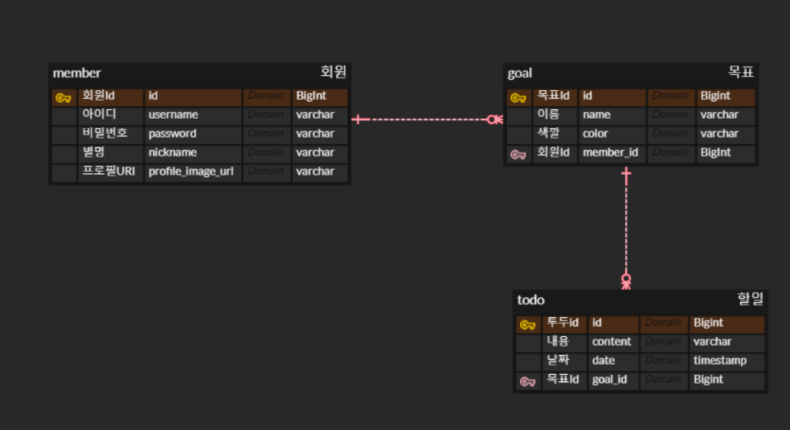

# 투둔디(todondy)
멋쟁이 사자처럼의 할 일 관리 애플리케이션 백엔드.

 
 

### 도메인 설명
- `Member`: 회원
- `Goal`: 이루고자 하는 목표.
- `Todo`: 할 일 

 
 

### DB 스키마

 
 

## API 목록
[API 명세](https://imaginary-psychology-5d4.notion.site/e42bafe9d9f7409ba762b33c1e7f66ef?pvs=4)
